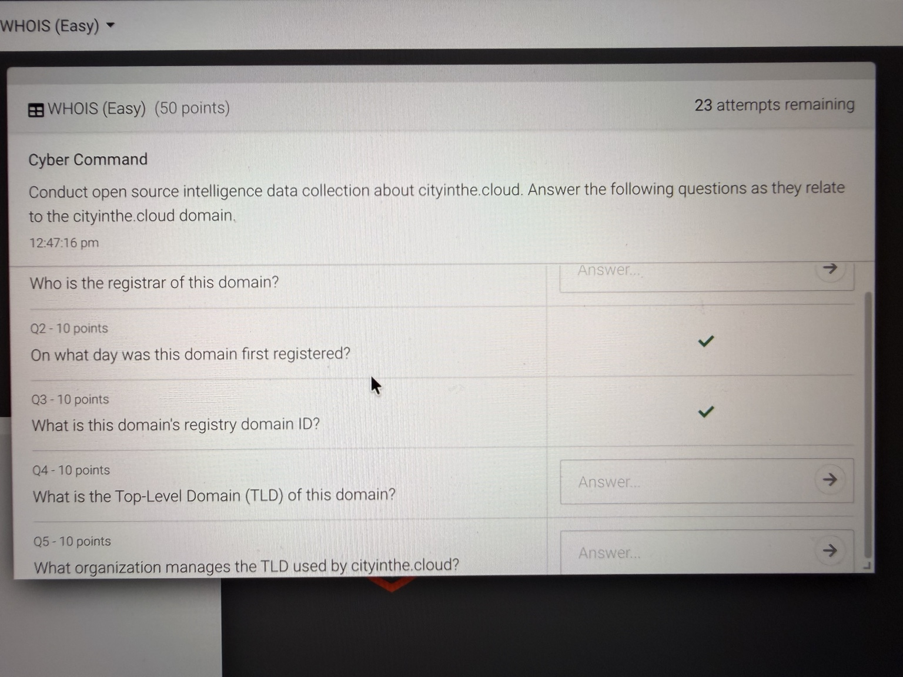
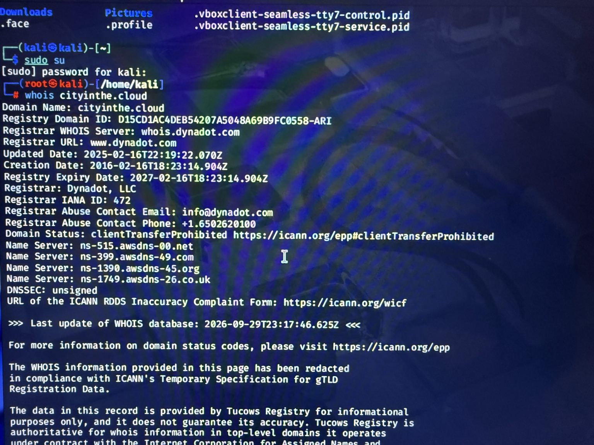

# WHOIS Domain Investigation

## Objective
Investigate cityinthe.cloud using public WHOIS records to identify its registrar, registration date, registry domain ID, and top-level domain (TLD). Use IANA's TLD record to identify the organization responsible for managing .cloud.

### Skills Learned
- Collecting public domain registration information for an OSINT investigation.
- Reading WHOIS fields and matching them to investigation questions.
- Distinguishing a domain registrar from a TLD registry operator.
- Identifying a domain's creation date, registry ID, and TLD.
- Checking authoritative sources when registration information changes.

### Tools Used
- Kali Linux terminal.
- WHOIS command-line utility.
- IANA Root Zone Database for TLD delegation information.

## Steps

### Step 1: Review the investigation questions
The WHOIS challenge asked for five details about cityinthe.cloud: its registrar, initial registration date, registry domain ID, TLD, and the organization managing that TLD.



*Ref 1: WHOIS challenge instructions and the five investigation questions.*

### Step 2: Query the domain's WHOIS record
I ran the following command in Kali Linux to retrieve the domain's public registration record:

```bash
whois cityinthe.cloud
```



*Ref 2: Terminal output showing the domain's registrar, creation date, registry domain ID, and name servers.*

### Step 3: Identify the registration details
I matched the question wording to the corresponding WHOIS fields. The first registration date appears as `Creation Date`.

| Detail | WHOIS field | Finding |
| --- | --- | --- |
| Registrar | Registrar | Dynadot, LLC |
| First registration date | Creation Date | 2016-02-16 |
| Registry domain ID | Registry Domain ID | D15CD1AC4DEB54207A5048A69B9FC0558-ARI |

### Step 4: Identify the top-level domain
The TLD is the final part of the domain name. For cityinthe.cloud, the TLD is **.cloud**.

### Step 5: Verify the organization managing .cloud
The registrar for an individual domain and the organization managing its TLD have different roles. Dynadot is the registrar listed for cityinthe.cloud. To identify the .cloud manager, I used the [IANA delegation record](https://www.iana.org/domains/root/db/cloud.html), which lists **ARUBA PEC S.p.A.** as the sponsoring organization as of September 29, 2026.

The same TLD record can be queried from the terminal with:

```bash
whois -h whois.iana.org cloud
```

Historical IANA records list **ARUBA S.p.A.**, so an older challenge answer may use that name. The Tucows text in the domain WHOIS output refers to the registry service infrastructure and should not be confused with IANA's sponsoring organization.

Source: [IANA .cloud delegation record](https://www.iana.org/domains/root/db/cloud.html).

